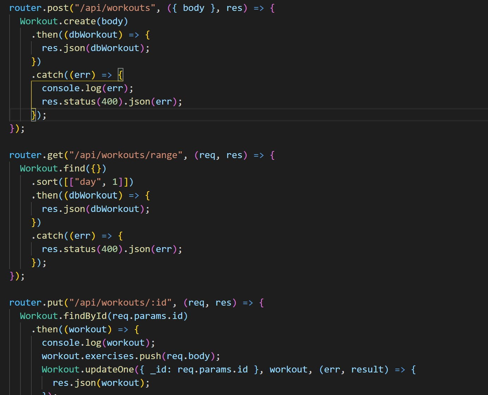
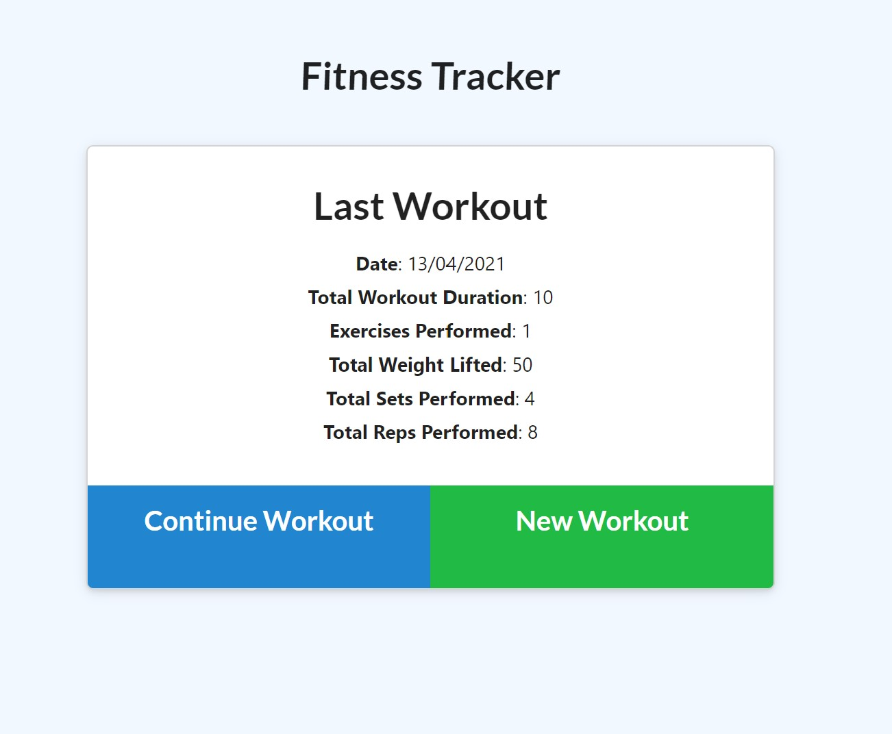

# Fitness Tracker

## Description

This project allows users to add their exercises for a day and view their stats afterwards, it uses mongodb as the database with use of mongoose and express packages

## Table Of Contents

- [Installation](##Installation)
- [Usage](##Usage)
- [License](##License)
- [Contributing](##Contributing)
- [Tests](##Tests)
- [Questions](##Questions)

## Installation

Users add an activity, if they performed more than one in the same day they can add different exercises, they can then see their last 7 days progress in the dashbaord page

## Usage

The above image is an example of the routes used for this peace of code while the below image shows how to deployed page looks

## License

This project is covered under the MIT License

## Contributing

[bencyna](https://github.com/bencyna/)

## Tests

go to https://radiant-hollows-58879.herokuapp.com/

## Questions

If you have any questions about this project, you can veiw my github account at https://github.com/bencyna/ or email me at benjamincyna@gmail.com
